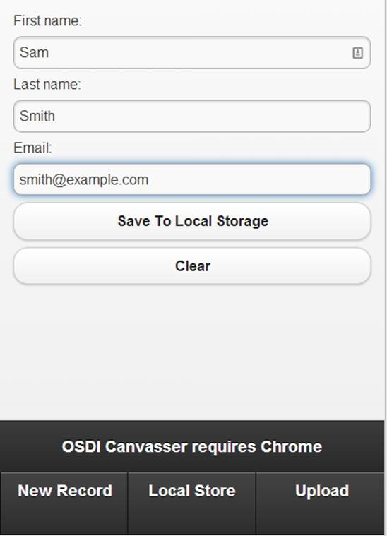
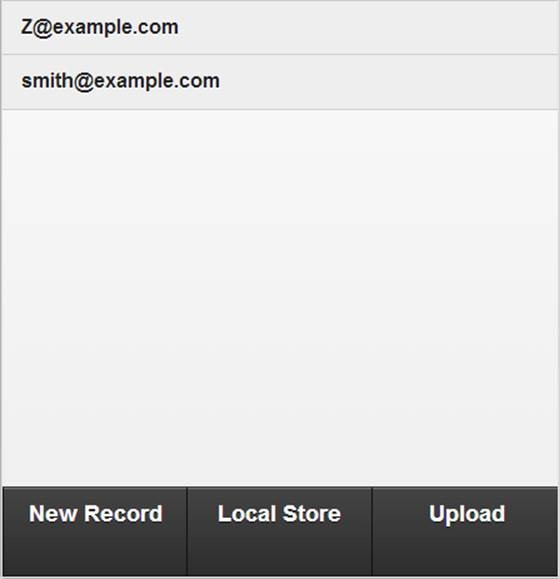
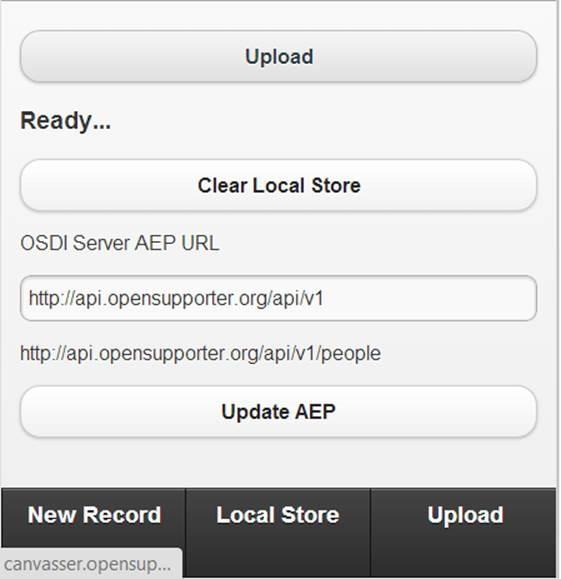

# OSDI Canvasser

Canvasser is an HTML5 offline canvassing application.  It currently requires Chrome to work correctly. 

It lets you work offline and enter new people into the local storage on the device.  When you are ready (and back in network coverage, you can then upload your local data to the OSDI server).
 
You can configure it to speak to a specific OSDI server.  You just give it the OSDI API Entry Point (AEP).
 
> Eg: http://api.opensupporter.org/api/v1
 
It then downloads the AEP and finds the person collection URI.

It defaults to our api.opensupporter.org.  So you can play with the app and then see your new uploads on the API server.

Live Version

> http://canvasser.opensupporter.org

# Screens

## New Record
This is where you enter new records

## Local Store
Displays records stored locally on device

## Upload
Controls for interacting with the server.  You can click upload to send to the OSDI AEP configured

